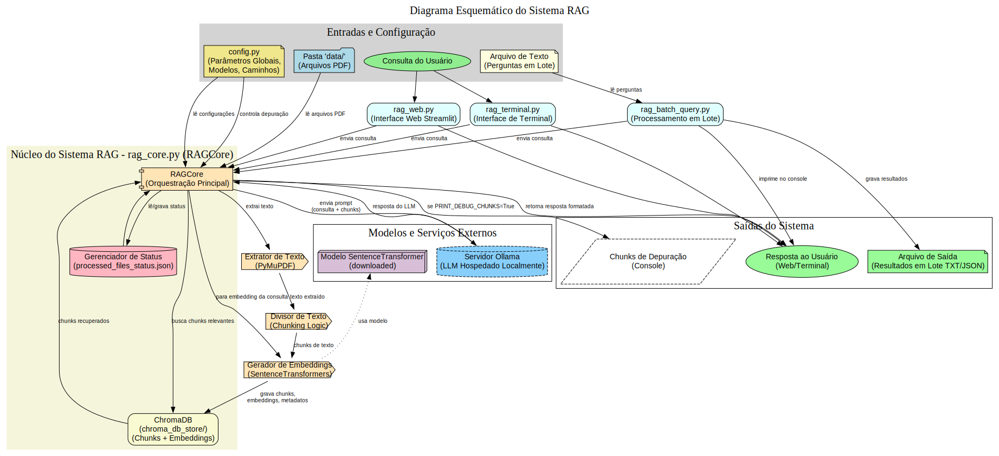

# Sistema de Pesquisa RAG com Ollama, Streamlit e ChromaDB

**Nota Importante:** O código-fonte base para o sistema descrito neste guia foi gerado com o valioso apoio da inteligência artificial Gemini, desenvolvida pelo Google. As funcionalidades e estruturas foram então iterativamente refinadas e adaptadas para os requisitos específicos deste projeto de pesquisa.

## Visão Geral do Projeto

Este projeto implementa um sistema de Geração Aumentada por Recuperação (RAG) que permite aos usuários fazer perguntas em linguagem natural sobre um conjunto de documentos PDF. O sistema utiliza **ChromaDB** para **armazenamento persistente** de chunks de texto e seus embeddings, resultando em inicializações significativamente mais rápidas após o primeiro processamento. As respostas são geradas por um Modelo de Linguagem Grande (LLM) hospedado localmente via Ollama, com o contexto relevante extraído dos documentos. A interface do usuário é fornecida através de uma aplicação web Streamlit.

O objetivo é fornecer uma ferramenta de pesquisa semântica poderosa e flexível que possa ser executada localmente, garantindo a privacidade dos dados e permitindo a customização dos modelos utilizados.

## 🚀 Funcionalidades Principais

* **Processamento de PDFs:** Extrai texto de arquivos PDF localizados em uma pasta `data/`.
* **Persistência com ChromaDB:** Chunks de texto e seus embeddings são armazenados no ChromaDB, evitando reprocessamento em cada inicialização.
* **Processamento Inteligente:** Verifica arquivos PDF novos ou modificados (com base na data de modificação e tamanho) e atualiza o banco de dados incrementalmente. Arquivos PDF removidos da pasta de dados têm seus respectivos chunks deletados do ChromaDB.
* **Geração de Embeddings:** Utiliza modelos `SentenceTransformers`.
* **Busca Vetorial Eficiente:** ChromaDB gerencia a indexação e busca.
* **Integração com Ollama:** Para utilizar LLMs localmente.
* **Interface Web Interativa:** Construída com Streamlit.
* **Interface de Terminal (Opcional):** Script `rag_terminal.py`.
* **Consultas em Lote:** Script `rag_batch_query.py`.
* **Configurável:** Via `src/rag_app/config.py`.
* **Timestamps no Chat:** Opcional.

## 🛠️ Tecnologias Utilizadas

* **Python:** Linguagem de programação principal (versão 3.10 ou 3.11 recomendada).
* **Ollama:** Para servir LLMs localmente.
* **Streamlit:** Para a interface web.
* **ChromaDB:** Para armazenamento persistente e busca de embeddings e documentos.
* **SentenceTransformers:** Para geração de embeddings de texto.
* **PyMuPDF (Fitz):** Para extração de texto de PDFs.
* **NumPy:** Para operações numéricas.

## 🏗️ Arquitetura do Sistema

O diagrama abaixo ilustra os principais componentes do sistema RAG, suas interações e o fluxo de dados, desde o processamento inicial dos documentos PDF até a geração da resposta para a consulta do usuário. Ele destaca como as entradas são processadas, onde os dados são armazenados (ChromaDB), e como os diferentes scripts e modelos interagem.



## 📂 Estrutura do Projeto

A estrutura de diretórios e arquivos esperada para o projeto é:

seu_projeto_rag/
├── src/
│   └── rag_app/             # Pacote Python principal
│       ├── init.py
│       ├── config.py
│       ├── rag_core.py
│       ├── rag_web.py
│       ├── rag_terminal.py
│       └── rag_batch_query.py
├── data/                     # PDFs de entrada (relativo à raiz do projeto)
├── chroma_db_store/          # Banco de dados ChromaDB (relativo à raiz do projeto)
├── assets/                   # Ativos como diagramas
│   └── diagrama_rag_sistema.svg
├── processed_files_status.json # Rastreia PDFs processados (relativo à raiz do projeto)
├── requirements.txt          # Dependências Python
└── README.md                 # Este arquivo


## ⚙️ Configuração e Execução do Sistema

Siga estes passos detalhados para configurar e executar o projeto.

### 1. Requisitos do Sistema
(Conforme detalhado anteriormente: Python 3.10/3.11, Ollama, Pip, Git, Hardware adequado)

### 2. Preparação do Ambiente

1.  **Instalar Python.**
2.  **Clonar o Repositório (se aplicável).**
3.  **Criar e Ativar um Ambiente Virtual:**
    Na pasta raiz do projeto (`seu_projeto_rag/`):
    ```bash
    python -m venv .venv
    ```
    Para ativar:
    * **Linux/macOS:** `source .venv/bin/activate`
    * **Windows (CMD):** `.venv\Scripts\activate.bat`
    * **Windows (PowerShell):** `.venv\Scripts\Activate.ps1`

### 3. Configuração do Ollama
(Instalar Ollama, baixar modelos LLM como `ollama pull llama3:latest`).

### 4. Instalação das Dependências Python
Com o ambiente virtual ativo, na pasta raiz do projeto:
```bash
pip install -r requirements.txt
```
(O arquivo requirements.txt deve listar pymupdf, sentence-transformers, ollama, numpy, streamlit, chromadb).

### 5. Configuração do Projeto (src/rag_app/config.py)

Ajuste os parâmetros em src/rag_app/config.py conforme necessário. Os caminhos como DEFAULT_DATA_FOLDER, CHROMA_DB_PATH, PROCESSED_FILES_STATUS_JSON são relativos ao diretório de onde os scripts são executados (geralmente a raiz do projeto ao usar os comandos abaixo).

### 6. Preparando Dados de Entrada (PDFs)

Crie a pasta data/ na raiz do projeto e adicione seus arquivos PDF.

### 7. Executando os Componentes do Sistema

Importante: Todos os comandos a seguir devem ser executados a partir da pasta raiz do seu projeto (seu_projeto_rag/), com o ambiente virtual ativo e o servidor Ollama em execução.

Interface Web com Streamlit (rag_web.py) - Recomendado para Usuários:
Este script inicia a interface gráfica interativa no seu navegador.

```bash
streamlit run src/rag_app/rag_web.py
```   
 Após a execução, acesse o endereço fornecido no terminal (geralmente http://localhost:8501).

Interface de Terminal Interativa (rag_terminal.py) - Alternativa:
Permite interagir com o sistema RAG diretamente pelo terminal.

```bash
python -m src.rag_app.rag_terminal
```   
 Siga as instruções no terminal para fazer perguntas. Digite sair para encerrar.

Processamento de Perguntas em Lote (rag_batch_query.py):
Executa múltiplas perguntas de um arquivo de texto e opcionalmente salva as respostas.

```bash
python -m src.rag_app.rag_batch_query <ARQUIVO_DE_ENTRADA> -o <ARQUIVO_DE_SAIDA_OPCIONAL>
```  
<ARQUIVO_DE_ENTRADA>: Caminho para seu arquivo .txt com uma pergunta por linha.
<ARQUIVO_DE_SAIDA_OPCIONAL>: Caminho para um arquivo .txt onde as perguntas e respostas serão salvas. Exemplo:
```bash
python -m src.rag_app.rag_batch_query data/lista_de_perguntas.txt -o resultados/respostas_em_lote.txt
```  
 Teste Direto do RAGCore (rag_core.py) - Para Desenvolvimento/Depuração:
O arquivo rag_core.py contém um bloco if __name__ == '__main__': que permite executar algumas consultas de teste predefinidas diretamente no console. Isso é útil para verificar a lógica central do RAG rapidamente.

```bash
python -m src.rag_app.rag_core
```  
 As perguntas de teste definidas dentro do rag_core.py serão executadas, e as saídas (incluindo chunks de depuração, se PRINT_DEBUG_CHUNKS estiver True em config.py) serão exibidas no console.

Comportamento de Inicialização (para todas as formas de execução):

Primeira Execução / Novos PDFs: O sistema processará os PDFs da pasta data/. Chunks e embeddings serão gerados e salvos no diretório CHROMA_DB_PATH. O arquivo PROCESSED_FILES_STATUS_JSON será criado/atualizado. Esta etapa inicial pode ser demorada.
Execuções Subsequentes: O sistema se conectará ao ChromaDB existente e usará o PROCESSED_FILES_STATUS_JSON para verificar o estado dos arquivos. Apenas PDFs novos ou modificados serão reprocessados. Isso torna a inicialização muito mais rápida.
### 8. Como Usar a Interface Web

(Conforme descrito anteriormente: interaja com o chat, consulte a barra lateral para informações do sistema).

🛠️ Solução de Problemas Comuns
(Conforme descrito anteriormente: erros Ollama, modelos, ChromaDB, qualidade das respostas, etc.).
Para problemas de estado inconsistente do ChromaDB ou processed_files_status.json, a solução mais robusta é parar a aplicação, deletar o diretório chroma_db_store/ e o arquivo processed_files_status.json, e reiniciar para forçar um reprocessamento completo.

🔄 Manutenção
(Conforme descrito anteriormente: backups do chroma_db_store/ e processed_files_status.json, reprocessamento, atualização de modelos e dependências).
Lembre-se que ao remover um PDF da pasta data/, o sistema deve limpar seus dados do ChromaDB e do arquivo de status na próxima inicialização.

💡 Possíveis Melhorias Futuras (TODO)
(Conforme descrito anteriormente).

📄 Licença
A definir.  